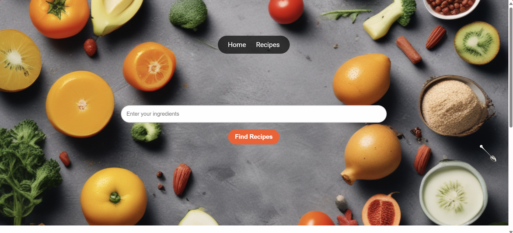
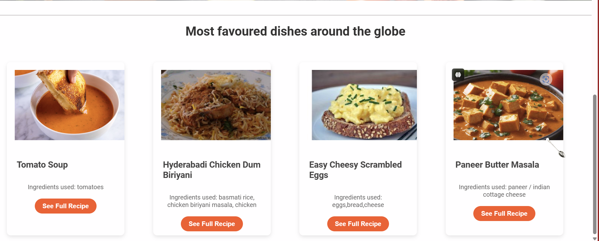
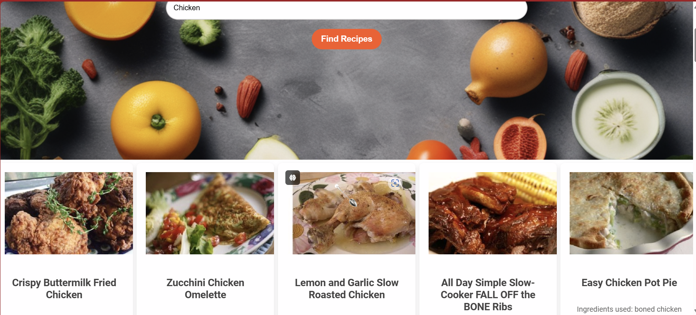
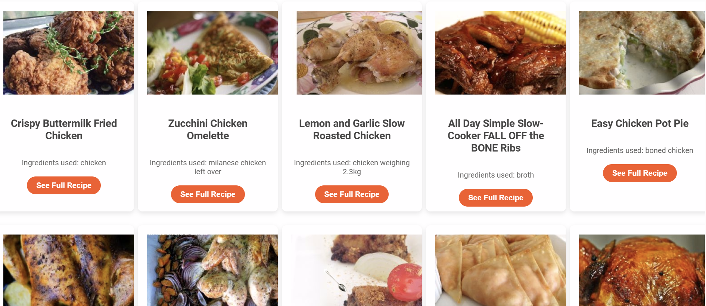
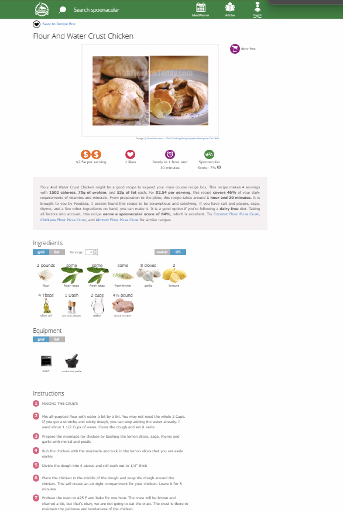

# Recipe Finder

## Introduction

Recipe finder is a website which is designed to be used for finding every possible recipe for given ingredients

## TechStack

- HTML
- CSS
- JavaScript

## Description

In our website we are using an api https://api.spoonacular.com/recipes/ and using the api provided we are able to create a user friendly website

## Features

1. Search bar
2. A wide range of food items

## Future Features

1. Option to load more recipes
2. voice to text features

## Output :

- <b>Home page : </b>
  
  
- <b>Search page : </b>
    
  
- <b>Ingredients Page : </b>

  

> [!Caution]
> The above api link can't be used unless we have a proper api key

> [!Important]
> This is our website for reference and checking the usage fridgewizard.netlify.app
